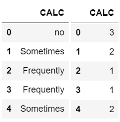

# Obesity Level Estimation using Machine Learning
 This is the ML Project about predict people obesity level with classification technique

## Dataset Description
Dataset yang digunakan berasal dari situs UCI Repository yang berisi tentang informasi kondisi fisik seseorang, riwayat keluarga, serta kebiasaan yang sering dilakukan. Informasi tersebut dapat menjadi bahan untuk memprediksi berapa level obesitas yang dialami oleh seseorang. Dataset tersebut terdiri dari 16 kolom yang terdiri dari

1. `Gender` : Jenis Kelamin
2. `Age` : Usia
3. `Height` : Tinggi badan
4. `Weight` : Berat badan
5. `family_history_with_overweight` : Riwayat keluarga yang mengalami kelebihan berat badan 
6. `FAVC` : Apa kamu sering makan makanan yang tinggi kalori?
7. `FCVC` : Apakah kamu selalu makan sayur di waktu makan?
8. `NCP`  : Berapa kali makanan utama yang dimakan setiap hari
9. `CAEC` : Apakah kamu makan diantara waktu makan
10. `SMOKE` : Apakah anda merokok
11. `CH2O` : Berapa banyak air yang kamu minum setiap hari
12. `SCC` : Apa kamu memonitoring jumlah kalori
13. `FAF` : Seberapa sering kamu melakukan aktivitas fisik
14. `TUE` : Berapa lama menggunakan perangkat elektronik seperti hp, video games, tv, komputer, dsb 
15. `CALC` : Seberapa sering minum alkohol
16. `MTRANS` : Transportasi apa yang sering digunakan
17. `NObeyesdad` : Level Obesitas

## Exploratory Data Analysis
Sebelum melakukan permodelan, ada beberapa hal yang perlu dicek terlebih dahulu. Hal-hal tersebut adalah sebagai berikut

### Missing Value
Missing value adalah cell yang kosong dalam data tabular. Cell kosong ini bisa disebabkan karena responden tidak mengisi data tersebut, atau ada informasi yang belum diketahui. Pada bagian ini akan dicek terlebih dahulu apakah dataset ini mengandung cell yang missing value atau tidak.

Untuk mengetahui jumlah baris yang mengandung missing value per kolom anda dapat menggunakan code berikut ini.

```python
df.isna().sum()
```
Code ini akan menghasilkan output sebagai berikut

```
Gender                            0
Age                               0
Height                            0
Weight                            0
family_history_with_overweight    0
FAVC                              0
FCVC                              0
NCP                               0
CAEC                              0
SMOKE                             0
CH2O                              0
SCC                               0
FAF                               0
TUE                               0
CALC                              0
MTRANS                            0
NObeyesdad                        0
dtype: int64
```
Berdasarkan hasil output tersebut, terlihat bahwa tidak ada kolom yang mengandung missing value sehingga tidak perlu penanganan lebih lanjut.

### Checking Duplicate Rows
Setelah itu, kita akan melakukan pengecekan apakah ada duplikasi pada data atau tidak. Untuk melakukan pengecekan terhadap duplikasi data, kita dapat menggunakan code berikut

```python
df.duplicated().sum()
```

Setelah dilakukan pengecekan ternyata terdapat 24 baris yang mengandung data duplikat. Oleh karena itu kita perlu menghilangkan data yang duplikat agar data yang sama tidak muncul di data latih dan data uji. Untuk menghilangkan data yang duplikat, kita dapat menggunakan code berikut.

```python
df.drop_duplicates(inplace=True)
```

Sehingga data yang tadinya ada 2114 baris berkurang menjadi 2087 baris

### Encoding untuk Data Kategorikal
Dalam data ini terdapat 8 kolom yang mengandung nilai kategorikal.

1. `Gender` dengan kategori `Female` (Wanita) dan `Male` (Pria)
2. `family_history_with_overweight` dengan kategori `Yes` dan `No`
3. `FAVC` dengan kategori `Yes` dan `No`
4. `CAEC` dengan kategori `Sometimes` (Kadang-kadang), `Frequently` (Sering), `Always` (Selalu), dan `no`
5. `SMOKE` dengan kategori `Yes` dan `No`
6. `SCC` dengan kategori `Yes` dan `No`
7. `CALC` dengan kategori `Sometimes`, `Frequently`, `Always`, dan `no`
8. `MTRANS` dengan kategori `Public_Transportation`, `Walking`, `Automobile`, `Motorbike`, dan `Bike`

Terdapat dua jenis data kategorikal
1. Data Nominal : Kategori tidak mempunyai urutan (contohnya merah, hijau, abu)
2. Data Ordinal : Kategori mempunyai urutan (contohnya kecil, sedang, besar)

Dua jenis data ini akan berbeda penanganannya. Untuk data nominal akan menggunakan one hot encoding, yaitu mengubah nilai kategori menjadi bentuk biner. Contohnya adalah sebagai berikut.


Karena kolom `Gender`, `family_history_with_overweight`, `FAVC`, `SMOKE` dan `SCC` tidak mempunyai urutan, maka kita dapat mengkonversikannya dengan teknik one hot encoding.

Untuk menggunakan teknik one hot encoding dapat menggunakan fungsi `get_dummies` dari `pandas`.

```python
onehot = pd.get_dummies(X[['Gender',
                  'MTRANS',
                  'family_history_with_overweight',
                 'SMOKE','SCC','FAVC']], dtype='float')
```

Sedangkan untuk data ordinal dapat menggunakan teknik label encoding, yaitu mengubah kategori menjadi bentuk angka. Contoh label encoding adalah sebagai berikut.



Untuk menggunakan teknik label encoding dapat menggunakan `.cat.rename_categories()` dari `pandas`.

```python
categories = {
    'no' : 0,
    'Sometimes' : 1,
    'Frequently' : 2,
    'Always' : 3
}

X['CALC'] = X['CALC'].astype('category')

X['CALC']=X['CALC'].cat.rename_categories(categories)
```

Karena kolom `CALC` dan `CAEC` mempunyai urutan, maka kita dapat mengkonversikannya dengan teknik label encoding.

Karena ini adalah kasus klasifikasi, maka kolom class (`NObeyesdad`) juga perlu dikonversi menjadi bentuk angka agar dapat dipelajari oleh model machine learning kita.

## Data Splitting
Dalam kasus ini kita akan membagi data menjadi 80% Train, 10% Validasi, dan 10% Test.

## Modelling
[On Progress]

